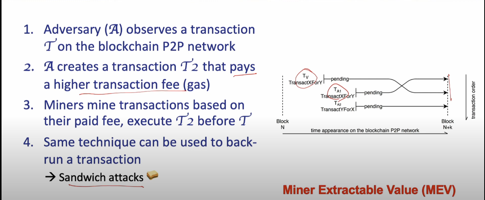

## Intro to DeFi

#### Risks in DeFi

> DeFi security - Issues on all Layers

* Network attacks
   * Eclipse/DoS attacks

* Consensus attacks
   * 51% attacks/Double-spending/Selfish mining

* Smart contract code bugs
   * Reentrancy/Authorization etc

* DeFi protocol composability attacks
   * Excessive arbitrage between pools, flash loans
   * Oracle attacks

* Bridge attacks

* Governance attacks

> Techincal structure security

Risk-free profit by exploting techincal structure of blockchain systems.

> Economic incentive security

Exploit the incentive structure of the protocol to realize the unintended profit at the expense of the protocol or its users.

> Front-running attacks

> DeFi dependencies & Systemic Risks

* Multiple significant price declines in cryptocurrencies

* Causing ripple effects
   * Liquidation
   * De-leveraging

* Stock markets have circuit breakers to stop losses

* Transaction fees on blockchain spiked, a regular coin transfer costed over 100 USD.