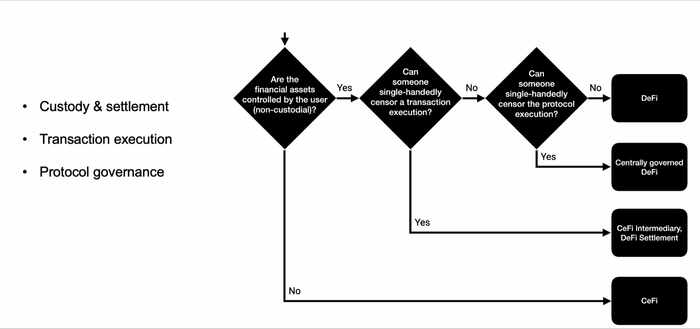

## Intro to DeFi

#### What is DeFi? 

> What is Finance?

Finance is the process that involves the creation, management and investment of money and financial assets.

> Financial assets/financial instruments

a non physical asset whose value is derived from a contractual claim.
Bank deposits, stocks, bonds, loan and derivatives.

> Financial services 

banking, lending/ borrowing, securities, insurance, trusts, funds

> Financial markets

marketplace for trading financial assets.

> Traditional Finance

Centralized and provides services like Banks, securities, insurance,
trust investment, fund management.

Hold custody of customer's assets.

Serves as intermediaries for transactions,
 * can censor transactions
 * rent seeking

Strict onboarding and continuous complaince rules,
KYC - Know Your Customer
AML - Anti Money Laundering
CFT - Combat for Financing of terrorism

Customer has no privacy, and has full account information of the  customer.

Opaque, siloed databases and applications.

Need to be trusted to operate correctly and securely.

> What is DeFi?

Financial infrastructure as an open, permissionless, and highly interoperable protocol stack built on public smart contract platforms.

