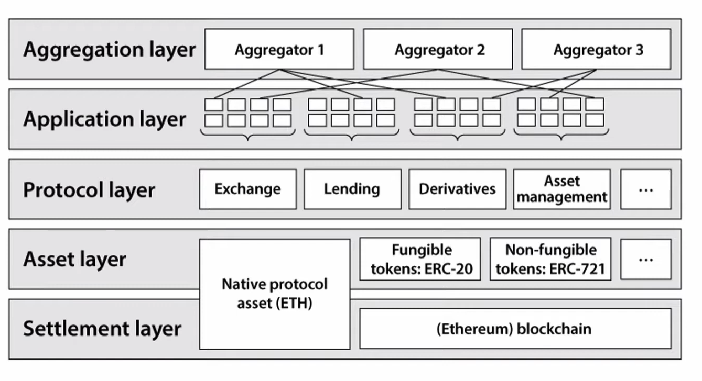
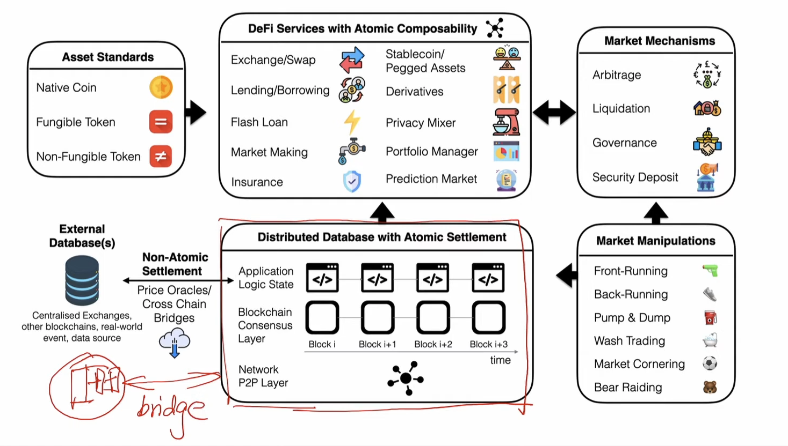
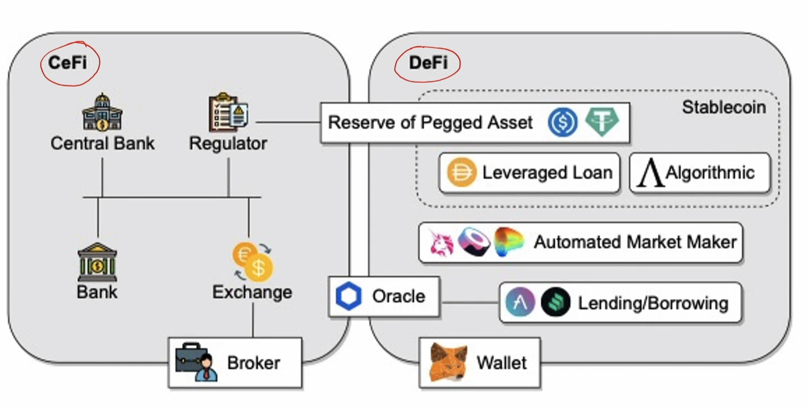

## Intro to DeFi

#### How DeFi? 

> DeFi Stack

DeFi is enabled by a decentralized smart contract platform.

Roles
 - User
 - Protocol (smart contract)
    - Governance
 - Keeper
 - Oracle
 - Bridge

