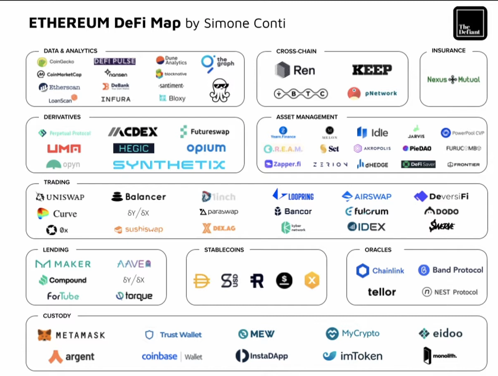
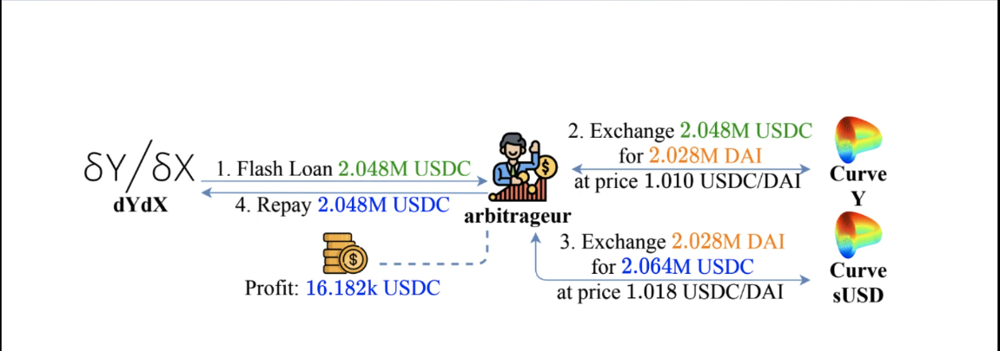

## Intro to DeFi

#### DeFi Services and Innovations

> DeFi building blocks and services

**Asset Tokenization**

Tokenization: Process of adding new assets to blockchain.

Token: The Blockchain representation of the asset.

Makes assets more accessible, easy to transfer, programmable.

Governance Token, security tokens (tokenized real estate), Non Fungible token (NFT), stablecoin.

> Stablecoin

Offchain (centralized) collateral (fiat, precious metal)

Onchain (decentralized) collateral (crypto assets)

Algorithmic (non-collateral) stabe coin

> DEX vs CEX

Centralized Exchange (CEX)
   * Custodial
   * Non transparency

Decentralized Exchange (DEX)
   * Non custodial
   * Transparency

CEX determines orders through order book.

DEX determines orders through CFMM, P2P/OTC, Exchange, Reserve aggreagator.

CFMM, Constant Function Market Maker

**Decentralized Lending**

> Lending in DeFi

Processing default is expensive; under collateralization.
Credit-worthiness

> Collateralized loans in DeFi

Over-collateralization; not based on credit
   * Collateralized debt positions: creating new tokens using collateral.
      e.g: MakerDAO
   * Collateralized debt markets: 
      * Pooled collateralized debt markets: e.g Compound, Aave
      * P2P collateralized debt markets
   * Under collateralization

> Flash Loans

* Blockchains enable atomic transactions
   * The actions within a transaction are executed entirely in sequence, or fail collectively.

* Pool lend assets within <ins>one</ins> transaction
   * Under the condition that the assets
      * are paid back by the end of the transaction
      * plus interests the lend amounts

   * Can grow to Billions of USD
      * without upfront costs (only transaction fees)

* Does not exist in CeFi!

**Other DeFi Building Blocks and Services**

* Decentralized Derivatives
   * Asset-based derivatives e.g Synthetix, Mirror
   * Event-based derivatives e.g Augur

* On-chain asset management
   * Non-custodial, different from traditional asset management
   * Semi-automatic rebalancing of portfolio, trend trading
   * e.g; Yearn, Set protocol

* Decentralized insurance