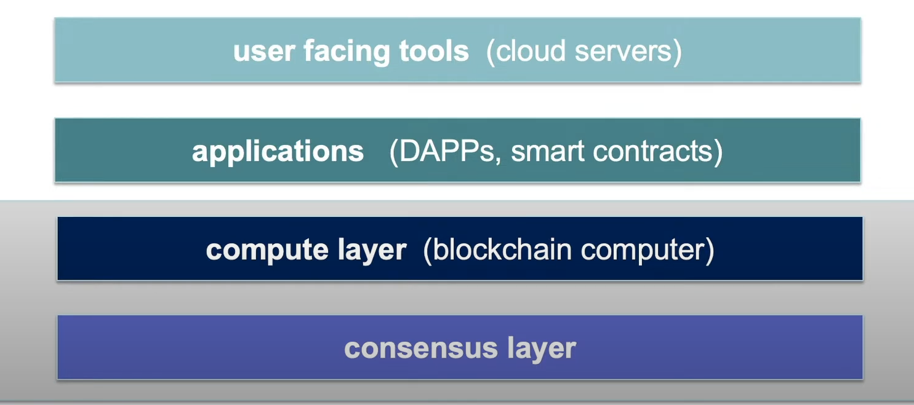

## What is Blockchain?

#### Introduction to Blockchain Technology

> What is a Blockchain?

Abstract answer: a blockchain provides corordination between many parties, when there is no single trusted party.

if trusted party exists => no need for blockchain

[finanical systems: often no trusted party]

> How blocks are added to the blockchain?

Signed transactions are sent, block miner compete to mine the block.

PoS, PoW

> Computer Layer : The Blockchain Computer

DApp logic is encoded in a program that runs on blockchain
* Rules are enforced by a <ins>public</ins> program
    => <ins>transparency:</ins> no single trusted 3rd party
* The DApp program is executed by parties who create new blocks
    => <ins>public verifiability:</ins> everyone can verify state transitions

> Apps Layer : Decentralized applications (DApps)

MakerDAO, dy/dX

> UI Layer : Common DApp Architecture

UI Layer : User facing servers

