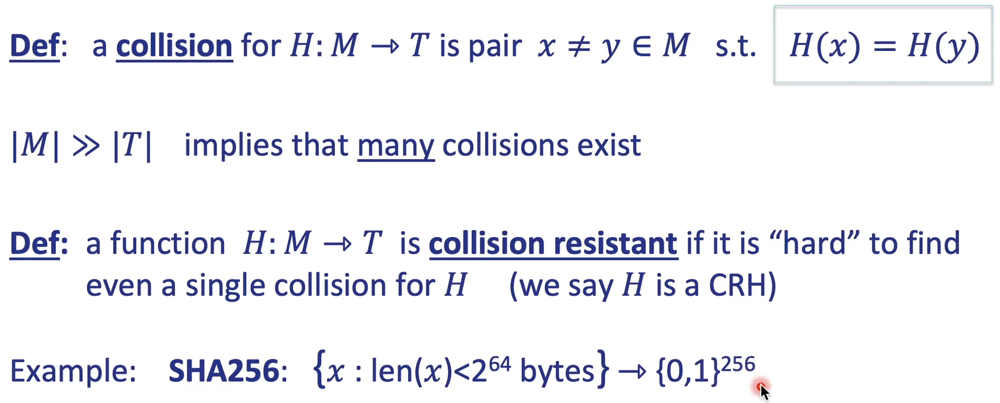
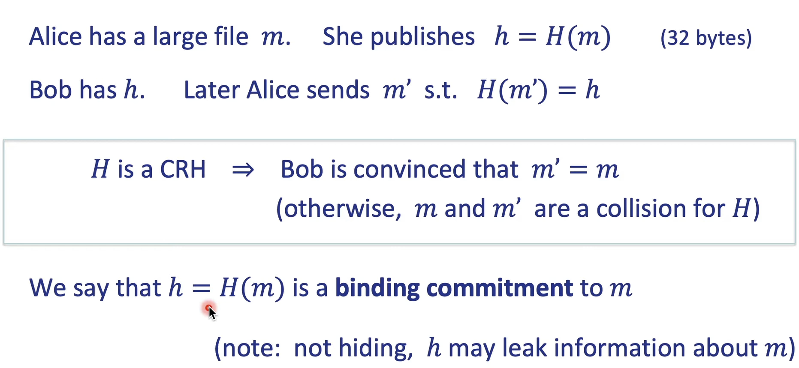
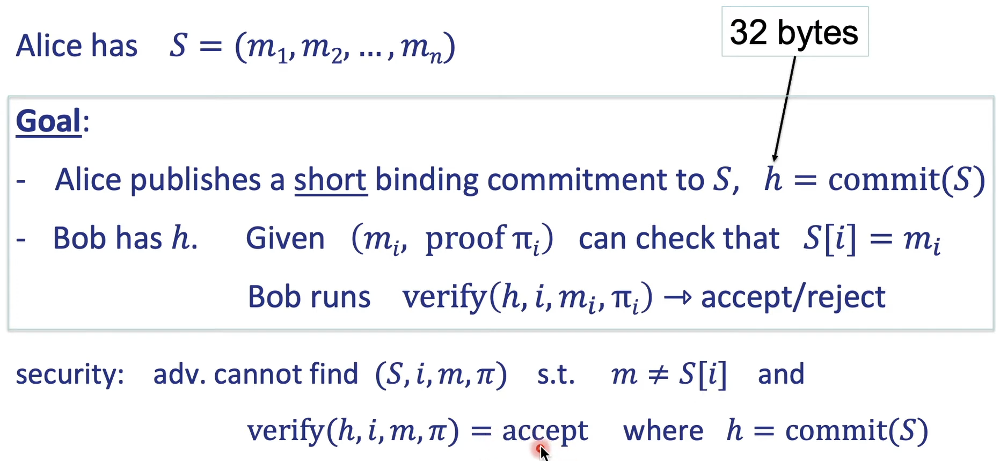
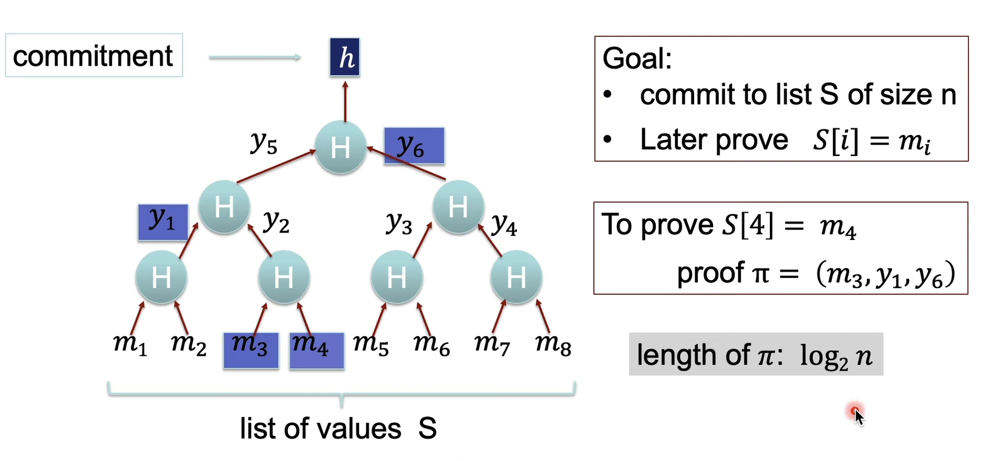
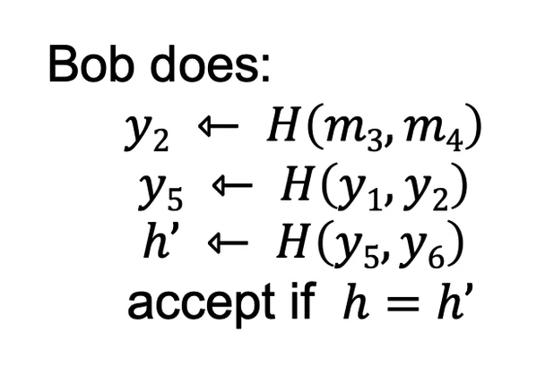
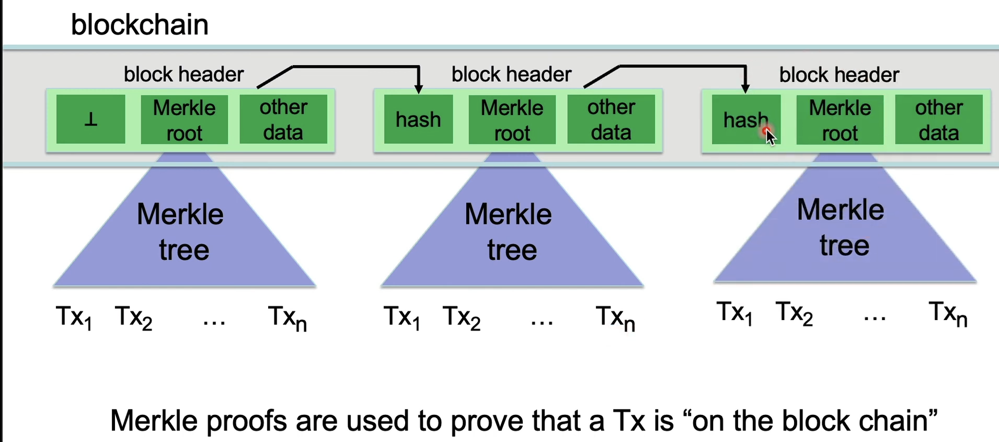

## What is Blockchain?

#### Cryptographic Hash Functions

> Cryptography background

(1) cryptographic hash functions

An efficiently computable function $H : M \to T$
where, $|M| >> |T|$

megabytes => hash value (32 bits)  $T = \{ 0, 1 \}^{256}$

> Collision resistance

**Learn more about SHA256**

> An application: committing to data

> Commiting to a list

> Merkle Tree

> Abstract blockchain

