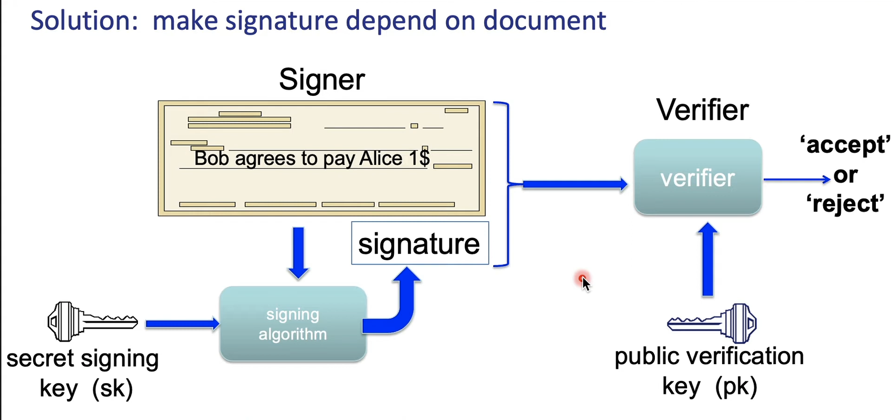

## What is Blockchain?

#### Digital Signatures

> Signatures

> Digital signatures : syntax

A signature scheme is a triple of algorithms:

* Gen(): outputs a key pair (pk, sk)
* Sign(sk, msg) outputs sig $\sigma$. 
* Verify(pk, msg, $\sigma$) outputs 'accept' or 'reject'

> Families of signature schemes

1. <ins>RSA signatures (not used in blockchains):</ins>

* long sigs and public keys ($\geq$ 256 bytes), fast to verify

2. <ins>Discrete-log signatures:</ins> Schnorr and ECDSA (Bitcoin, Ethereum)

* short sigs (48 or 64 bytes) and public keys (32 bytes)

3. <ins>BLS Signatures </ins>: 48 bytes, aggregatable, easy threshold (Ethereum 2.0, Chia, Dfinity)

4. <ins>Post quantum</ins> signatures: long ($\geq$ 768 bytes)

> Signatures on the blockchain

Signatures are used everywhere:

* ensure Tx authorization,
* governance votes,
* consensus protocol votes

