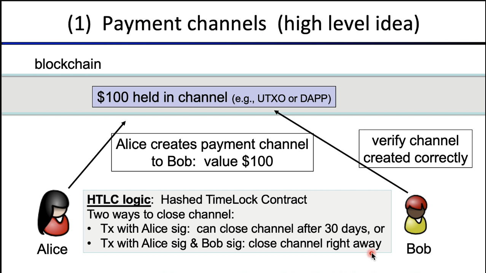
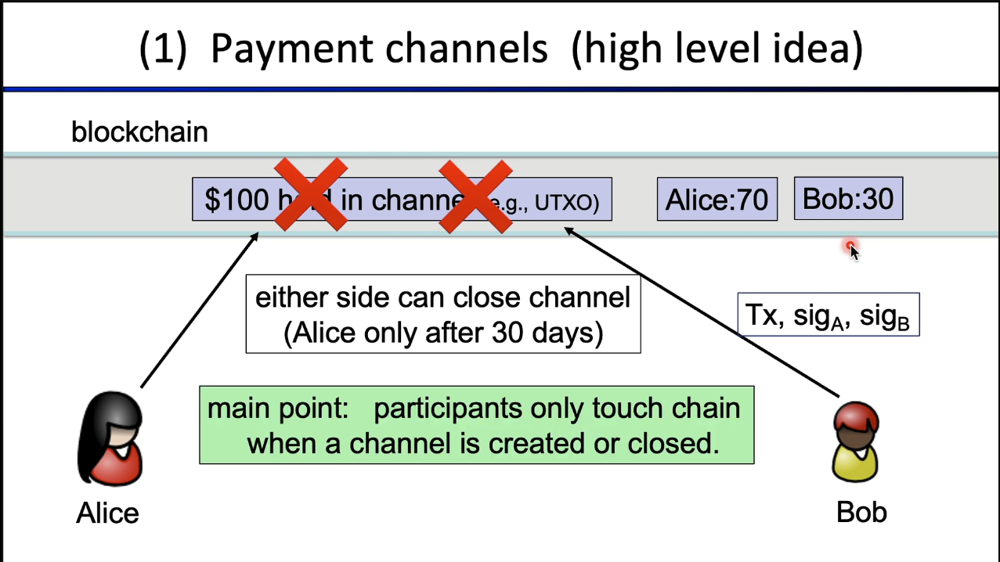
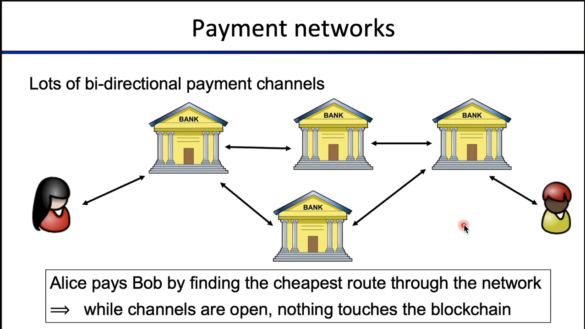
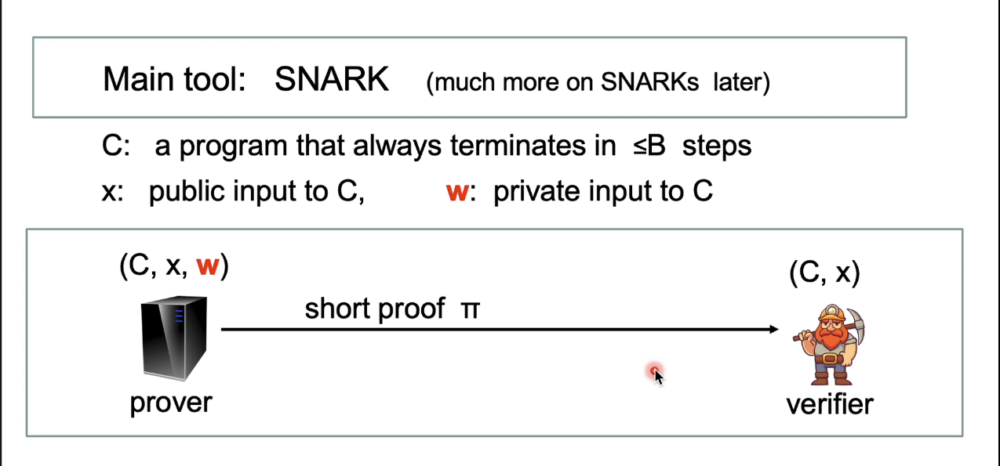
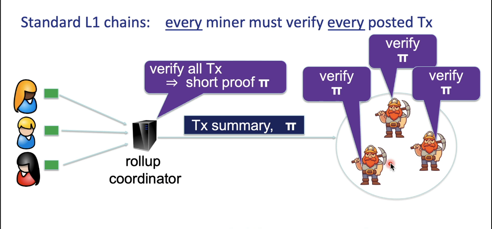
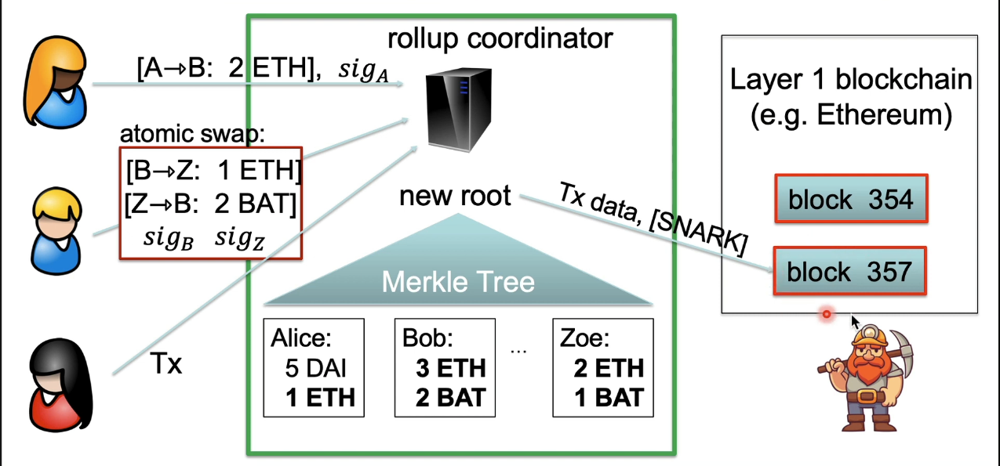

## What is Blockchain?

#### Scaling Blockchains

> Scaling

Transaction rates (Tx/sec):

* Bitcoin: can process about 5 (Tx/sec)
* Ethereum: can process about 20 (Tx/sec)

> Scaling approaches

Many approaches to scaling blockchains:

* Faster consensus: modern blockchains (e.g Solana, Polkadot, Avalanche, ...)

* Payment channels: most Tx are off chain P2P (e.g Lightening)

* Layer 2 approaches:
    zkRollup, optimistic rollup: batch many Tx into single Tx

* Sidechains: Polygon and others

> 1) Payment Channels

***Bi-directional chains are also possible***

> 2) Payment Networks

> Scaling Ethereum using Rollup

SNARKS - Succinct Non-Interactive Argument of Knowledge

> Rollup : zk and optimistic

> zkRollup: simplified

> Transferring assets to and from L2

* Transactions within a Rollup system are easy:
    * Batch settlement on L1 network (e.g Ethereum)

* Moving funds in to or out of Rollup system (L1 $\iff$ L2)
    * Requires posting more data on L1 network $\implies$ higher Tx fees

* Moving funds from one Rollup system to another (L2 $\iff$ L2)
    * Either via L1 network(expensive), or via a direct L2 $\iff$ L2 bridge (cheap)

> Migrating a project from L1 Ethereum to L2 zkRollup

zkEVM (e.g MatterLabs and others)

Solidity compatibility:
* Coordinator can produce a SNARK proof for the execution of a short solidity program:
    => easy to migrate a DApp from L1 Ethereum to L2 zkRollup
    => reduced Tx fees and increased Tx rate compared to L1

> Optimistic Rollup (simplified) [e.g Optimism, Arbitrum]

Same principle as zkRollup, but no SNARK proof

Instead, coordinator posts Tx data on chain <ins>without</ins> a proof
* Then give a few days for validators for complain:
    - if a posted Tx is invalid =>
        - anyone can submit a **fraud proof** and win a reward,
        - Rollup server gets slashed.

Benefit: simple full EVM compatibility, less work for server.

> Data availability : zkSync vs zkPorter

Is the coordinator a central point of failure?

Answer: No

coordinator fails => users find another coordinator to produce proofs.

- Complication: new coordinator needs all current account information.
    - How to get the data if the old coordinator is dead?

- Two solutions: zkSync and zkPorter. They work concurrently.

- <ins>**zkSync**</ins>: stores all Tx data on the L1 blockchain (Ethereum)
    - L1 chain accepts Tx batch only if it includes summary of all Tx
    - Other coordinators can reconstruct L2 state from L1 blockchain
    - Downside: high Ethereum Tx fees. Good for high value assets.

- <ins>**zkPorter**</ins>: store Tx data on a new blockchain
    - maintained by a set of staked coordinators.
    - cheap off-chain storage, but lower guarantee than zkSync.