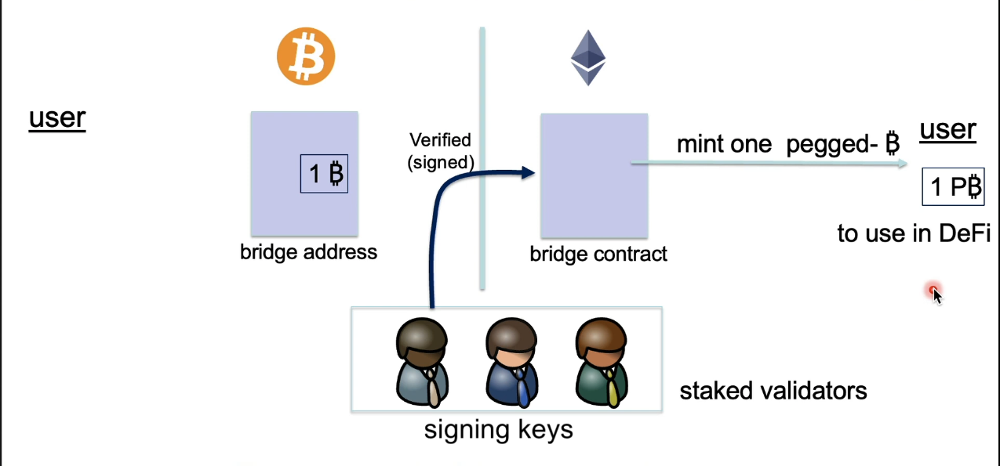
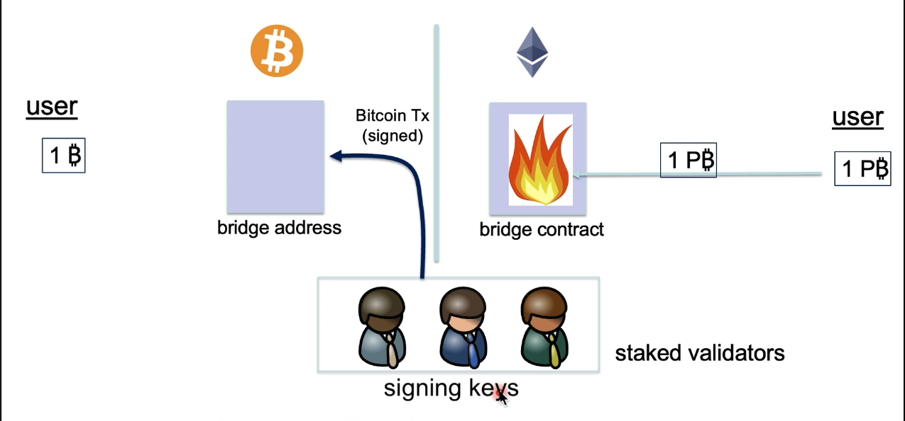

## What is Blockchain?

#### Interchain Operability

> Interoperability

- Interoperability:
    - a user owns funds or assets on one blockchain system.
    - Goal: enable the user to move funds and/or assets to another system.

- Composability:
    - enable a DApp on one chain to call a DApp on another.

Several cross-chain protocols: XCMP, IBC, CCIP, ...

> How to move assets? Federated Bridge (simplified)

Trustless Bridges with Bitcoin is not possible.

Why external validators?

bridge contract cannot store Bitcoin signing key