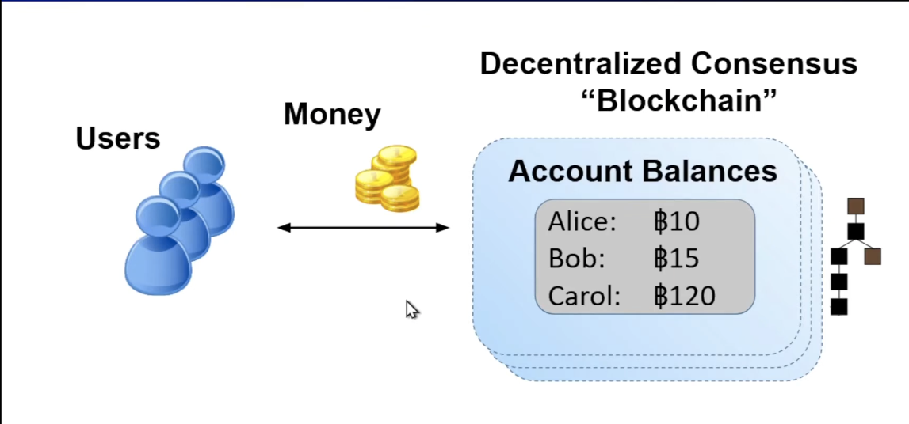
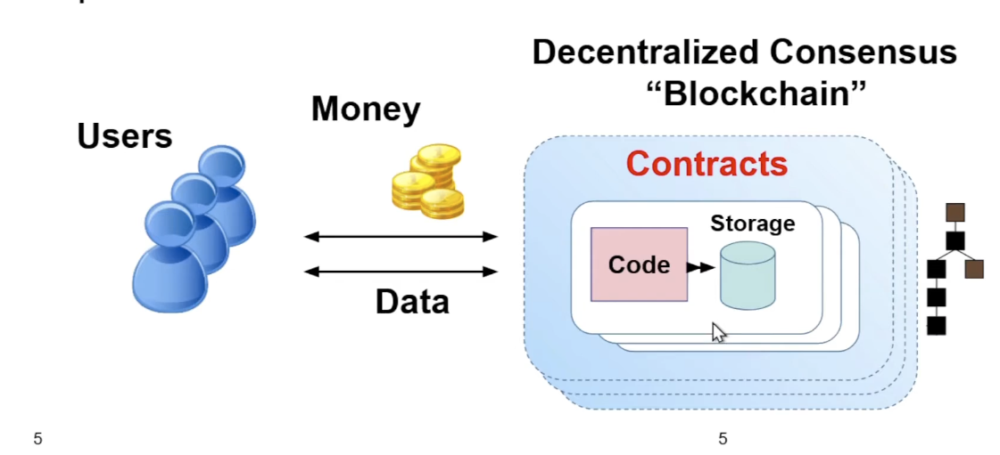
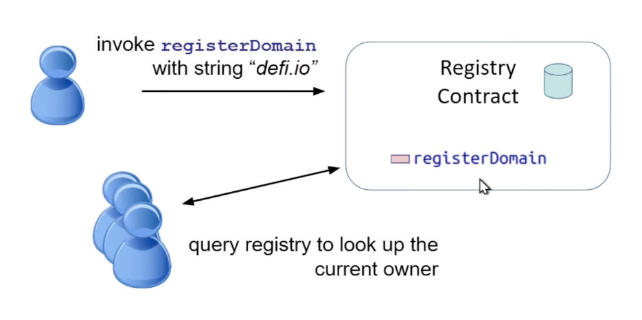
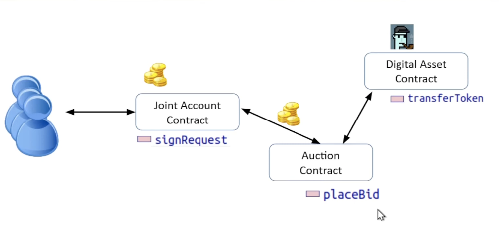

## Intro to Smart Contracts

#### Smart Contract from programmer perspective

> Digital currencies : just one blockchain application



**Smart Contracts**: user-defined programs running on the blockchain



> Example: Domain Name Registry in Ethereum

```solidity
// SPDX-License-Identifier: MIT
pragma solidity ^0.8.20;

contract MyRegistry {
    mapping ( string => address ) public registry;

    function registerDomain(string memory domain) public {
        //Can only reserve new unreserved domain names
        require(registry[domain] == address(0));

        //Update the owner of this domain
        registry[domain] = msg.sender;
    }

}
```



> Interaction between contracts



**<ins>Contract class</ins>**: Defines the program code and storage variables for a contract.

**<ins>Contract object</ins>**: an instance of the class living on the blockchain

**<ins>Storage fields</ins>**: variables stored by the contract.

**<ins>Functions/methods</ins>**: can be invoked to run the given code, updating the state of the contract.

**<ins>Access control</ins>**: Use "require()" to cancel the transaction if it isn't authorized. We can inspect the caller that invoked the function.

**<ins>Composition</ins>**: interaction between multiple contracts