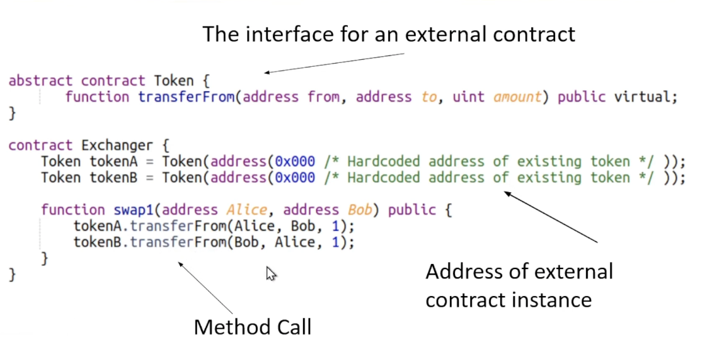
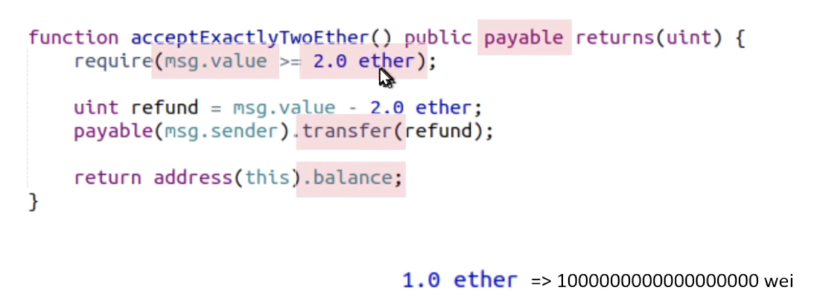
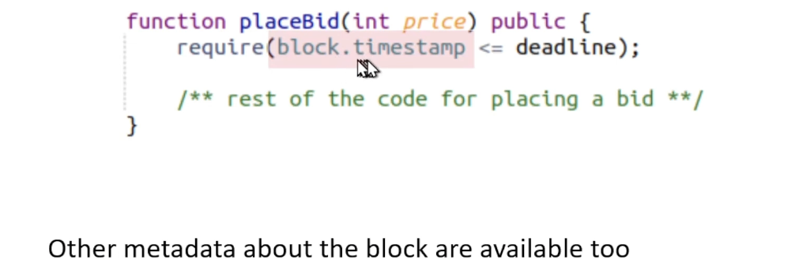

## Intro to Smart Contracts

#### Ethereum Programming Basics

> Solidity and Ethereum Bytecode

Solidity|Ethereum Virtual Machine (EVM)|
---|---: 
High Level Language|Low Level Bytecode|

> Solidity and Data Types

Solidity is statically typed, 

Like Java, C, Rust,... unlike Python or javascript

- Integers
    - uint
    - int

- Mapping: a key-value storage/hash table
    - Every key is initially mapped to zero.

- There is no built-in way to query the length of the mapping, or iterate over its non zero elements. A seperate variable can be used.

> Function signatures

```solidity
function getCurrentPrice(int slidingWindowSize) public view
    returns(int price, int confidence) {
        /* Compute the current price using on-chain data
        ... */
    }
```

getCurrentPrice - Name
slidingWindowSize - Argumenet
public - Visibility modifier
view - Mutability Modifier
return types

> Constructors

Invoked when initially creating the contract
Used to customize settings or give an initial state

```solidity
contract BoardAction {
    address public president;
    address public vicePresident;

    constructor(address initialPresident, address initialVP) public {
        /** initialize the contract **/
        president = initialPresident;
        vicePresident = initialVP;
    }
}
```

> Visibility modifiers

For functions:

```solidity
function calledByAnyone() public { /* anyone can call */}
function calledInternally() internal { 
    /* only called by another function in this contract */}
```

For instance variables:

```solidity
int public myPublicField;
/* A getter method is created automatically */
```

```solidity
int private myPrivateField;
/* No getter method is provided */
```

> Mutability modifiers

```solidity
function ordinary() public {
    /* can modify state and call other functions */
}
```
Read - Only
```solidity
function viewOnly() public view {
    /* can't modify any storage or call another non-view function */
}
```
No Read/Write
```solidity
function localOnly() public pure {
    /* doesn't even read any state either */
}
```

> Events

There are two main ways to observe the state of the contract:

- Using **view** functions, such as getter functions for public fields
- Looking at **event logs**. Can "subscribe" to events of a contract

```solidity
event Registered(address registrant, string domain);

function registerDomain(string memory domain) public {
    //Can only reserve new unreserved domain names
    require(registry[domain] == address(0));

    //Update the owner of this domain
    registry[domain] = msg.sender;

    emit Registered(msg.sender, domain);
}
```

> Calling methods of other contracts



> Working with native currency



> Reading the current time



