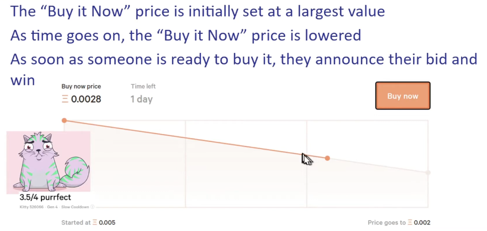

## Intro to Smart Contracts

#### Smart Contract Case Study: Dutch Auction

> Cryptokitties is based on Dutch Auctions



> Dutch auction in solidity

```solidity
// SPDX-License-Identifier: MIT
pragma solidity ^0.8.18;

import "@openzeppelin/contracts/token/ERC721/IERC721.sol";
import "@openzeppelin/contracts/security/ReentrancyGuard.sol";
import "@openzeppelin/contracts/access/Ownable.sol";

/**
 * @title DutchAuction
 * @notice Implements a Dutch auction mechanism for selling ERC721 tokens like KittyToken.
 * @dev This contract supports a descending price auction for a single ERC721 token.
 */
contract DutchAuction is ReentrancyGuard, Ownable {
    // Address of the ERC721 token contract
    IERC721 public immutable nftContract;

    // Token ID being auctioned
    uint256 public immutable tokenId;

    // Address of the seller (token owner)
    address public immutable seller;

    // Starting price of the auction in wei
    uint256 public immutable startingPrice;

    // Ending price of the auction in wei
    uint256 public immutable endingPrice;

    // Duration of the auction in seconds
    uint256 public immutable auctionDuration;

    // Timestamp when the auction started
    uint256 public immutable startTime;

    // Boolean to track if the auction has ended
    bool public auctionEnded;

    /**
     * @notice Emitted when the auction is concluded with a winning bidder.
     * @param buyer The address of the auction winner.
     * @param price The final price paid for the token.
     */
    event AuctionEnded(address indexed buyer, uint256 price);

    /**
     * @dev Sets up the Dutch auction with the specified parameters.
     * @param _nftContract Address of the ERC721 token contract.
     * @param _tokenId Token ID to be auctioned.
     * @param _startingPrice Starting price of the auction.
     * @param _endingPrice Ending price of the auction.
     * @param _auctionDuration Duration of the auction in seconds.
     */
    constructor(
        address _nftContract,
        uint256 _tokenId,
        uint256 _startingPrice,
        uint256 _endingPrice,
        uint256 _auctionDuration
    ) Ownable(msg.sender) { // Call the Ownable constructor
        require(_nftContract != address(0), "Invalid NFT contract address.");
        require(_startingPrice > _endingPrice, "Starting price must be greater than ending price.");
        require(_auctionDuration > 0, "Auction duration must be greater than zero.");

        nftContract = IERC721(_nftContract);
        tokenId = _tokenId;
        seller = msg.sender; // Owner of the token initializes the auction
        startingPrice = _startingPrice;
        endingPrice = _endingPrice;
        auctionDuration = _auctionDuration;
        startTime = block.timestamp;

        // Transfer token ownership to the auction contract
        nftContract.transferFrom(msg.sender, address(this), _tokenId);
    }

    /**
     * @notice Calculates the current price of the auctioned token.
     * @return The current price in wei.
     */
    function getCurrentPrice() public view returns (uint256) {
        if (block.timestamp >= startTime + auctionDuration) {
            return endingPrice;
        }

        uint256 timeElapsed = block.timestamp - startTime;
        uint256 priceDecrement = (startingPrice - endingPrice) * timeElapsed / auctionDuration;

        return startingPrice - priceDecrement;
    }

    /**
     * @notice Ends the auction by purchasing the token at the current price.
     * @dev Transfers the NFT to the buyer and funds to the seller.
     */
    function buy() external payable nonReentrant {
        require(!auctionEnded, "Auction already ended.");
        uint256 currentPrice = getCurrentPrice();
        require(msg.value >= currentPrice, "Insufficient payment for the current price.");

        auctionEnded = true;

        // Transfer the NFT to the buyer
        nftContract.transferFrom(address(this), msg.sender, tokenId);

        // Send funds to the seller
        (bool success, ) = seller.call{value: msg.value}("");
        require(success, "Failed to transfer funds to the seller.");

        emit AuctionEnded(msg.sender, currentPrice);
    }

    /**
     * @notice Withdraws the NFT back to the seller in case the auction does not conclude successfully.
     * @dev Only callable if the auction duration has elapsed without a buyer.
     */
    function withdrawUnsoldNFT() external nonReentrant onlyOwner {
        require(!auctionEnded, "Auction already ended.");
        require(block.timestamp >= startTime + auctionDuration, "Auction duration not yet elapsed.");

        auctionEnded = true;

        // Transfer the NFT back to the seller
        nftContract.transferFrom(address(this), seller, tokenId);
    }
}

```