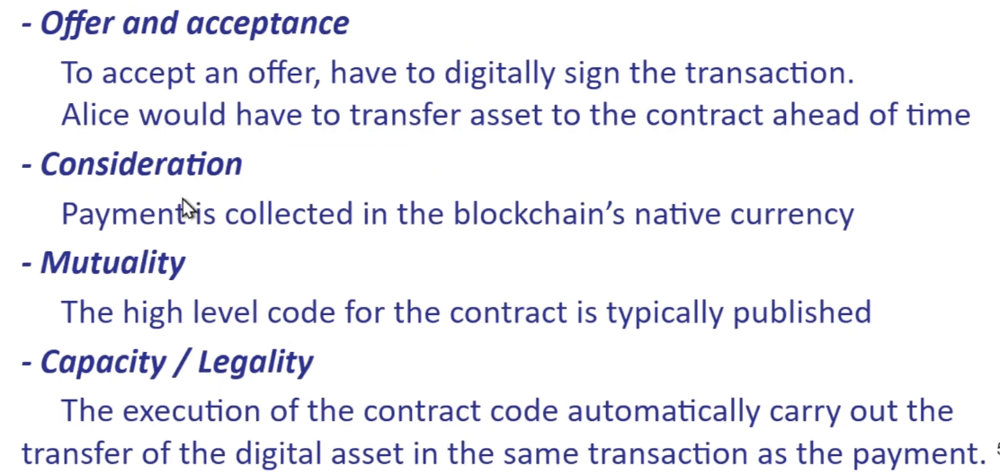

## Intro to Smart Contracts

#### Smart Contracts vs Real World Contracts

> Traditional Contracts: The Basic elements

- Offer and acceptance
- Consideration
- Mutual agreement
- Legality and Capacity

How can a smart contract do this?

