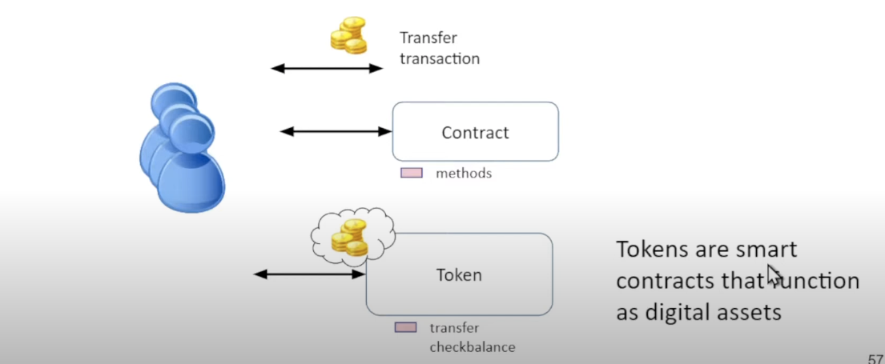

## Intro to Smart Contracts

#### Fungible and Non Fungible Tokens

> What are tokens?

ERC 721 - NFT
each asset in a series has distinct ID, attributes
https://eips.ethereum.org/EIPS/eip-721

ERC 20 - Fungible Tokens
the assets are interchangeable, can be summed up
https://eips.ethereum.org/EIPS/eip-20